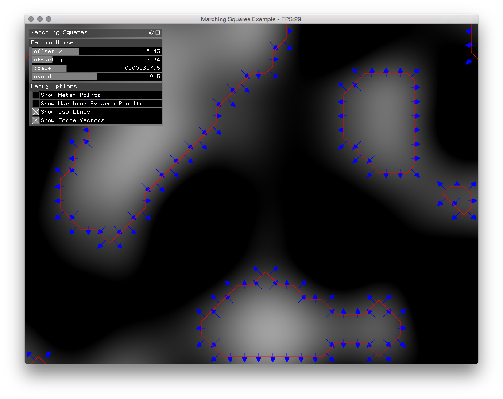

# Marching Squares Example

This example is a very basic implementation of the [marching squares algorithm](https://en.wikipedia.org/wiki/Marching_squares). Right now the application runs rather slow because the pixel input from the Perlin Noise FBO which has to copy the pixel data from the GPU back to the CPU.

The Perlin Noise FBO is derived from my [Perlin Noise Shader example](https://github.com/davidbeermann/timely-matter/tree/master/examples/PerlinNoiseShader).