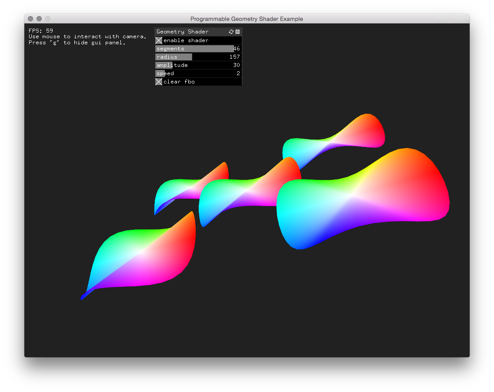

# Programmable Geometry Shader Example

This example uses modern OpenGL – read programmable graphics pipeline – in order to generate 3D geometry out of single vertices via shaders written in GLSL. This example is slightly more complex than the ones I could find, since the shader programm also generates the colors per vertex.

## Resources

* [ofBook – Introducing Shaders](https://github.com/openframeworks/ofBook/blob/master/chapters/shaders/chapter.md)  
My intial starting point intothe world of shaders.
* [Learning Modern OpenGL](http://www.codeproject.com/Articles/771225/Learning-Modern-OpenGL)  
A very quick overview but helpful nevertheless.
* [Modern OpenGL 3.0+ - Shader Files](https://www.youtube.com/watch?v=aA112viAx7c&index=8&list=PLRtjMdoYXLf6zUMDJVRZYV-6g6n62vet8)  
A quick refresher on shaders and how they are implemented in native C++. Overall very interesting YouTube playlist based on the course [Modern OpenGL](http://www.sonarlearning.co.uk/coursepage.php?topic=game&course=ext-bb-modern-opengl-gr) by [Sonar Learning](http://www.sonarlearning.co.uk/).
* [Open.GL tutorial site](https://open.gl/)  
I found this one the most approachable tutorial on modern OpenGL. Here's a step-by-step explanation on [how to create geometry shaders](https://open.gl/geometry).
* [Learn OpenGL](http://www.learnopengl.com/)  
The self-proclaimed #1 resource on OpenGL. The chapter on [geometry shaders](http://www.learnopengl.com/#!Advanced-OpenGL/Geometry-Shader) clarified some misconceptions and provided the starting point to assign colors per vertex.
* [gpuParticleSystemExample](https://github.com/openframeworks/openFrameworks/tree/master/examples/gl/gpuParticleSystemExample)  
Although well beyond the scope of what this example achieves, this of example was the main source code I referred to.